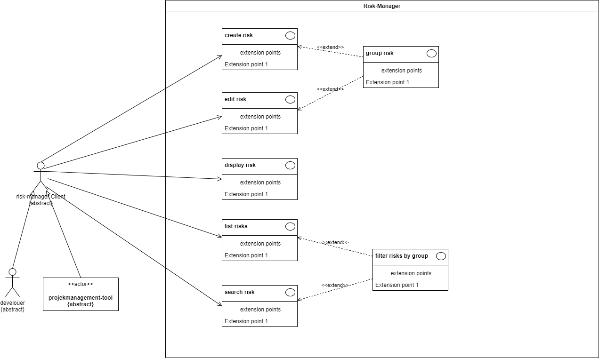

= Risk Manager
[[main-purpose]]
Is a tool to manage and track identified technical risks and -depts in agile driven software projects.
It supports creation and assessment of risks. They can get prioritized and grouped to get them a context.

Risks and risk-groups can get assigned to a project context, so the risks and technical depts can get managed for multiple
projects in one instance.

Riskmanager provides user-interfaces for direct interaction as well as apis for integration in any project management tool.

Defined extension points allows to add custom and potentially proprietary tools and persistence options as
plugin, without need to integrate them in the project directly.

.Overview of the core use-cases

== Documentation

The documentation is placed in code using https://asciidoctor.org/[Asciidoc].

The following documents are currently available:

. link:https://github.com/users/stueberm1/projects/1/views/3[Backlog]
. link:https://github.com/users/stueberm1/projects/1/views/4[Roadmap]
. xref:documentation/arc-documentation/risk-manager-architecture-description.adoc[Architecture description]

== Installation

== Usage

## Contributing

Pull requests are welcome. For major changes, please open an issue first
to discuss what you would like to change. If the change meets goals of the project as well as the
xref:documentation/arc-documentation/risk-manager-architecture-description.adoc[architecture constraints],
I would like to integrate it.

Please make sure to update tests as appropriate.

## License

link:LICENSE[Apache License 2.0]